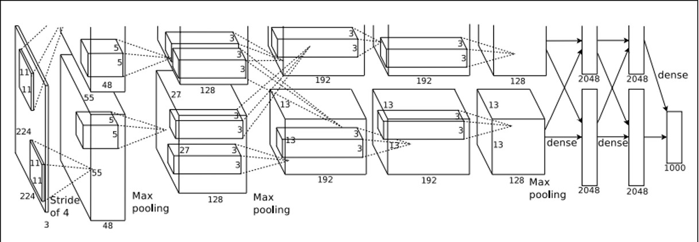
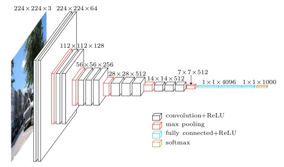
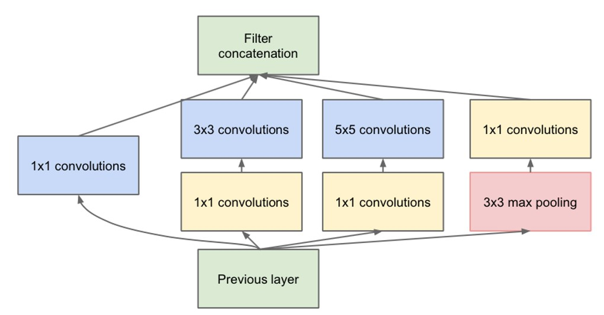

现在各种复杂的神经网络模型当然不是突然出现在世界上的，一定有一个演进更新的过程。

<!--more-->
在图像分类领域，从古老的Lenet到如今的Resnet，这一路走来，人们在改进卷积神经网络模型方面发现了什么问题，做了哪些思考，又进行了什么改进。在这篇文章中，我会简单的介绍一下各个经典卷积神经网络模型都做出了什么改进，仅仅是主要思想，不涉及论文细节。

通俗意义上的卷积神经网络来自于1998，Yann LeCun、Yoshua等人搭建了一个多层神经网络模型，并且发现卷积操作对图像的特征提取有一个很好的表现，于是将卷积操作引入神经网络中，这也就是我们现在说的卷积神经网络。但是当时并没有引起很大的反响，因为卷积神经网络没有严谨的数学推理，并且在当时的无论是数据量和计算能力都无法撑起这个算法。这个现象我们通常叫做生不逢时。LeNet的结构如下图所示，简单清晰明了，来自1998年的卷积神经网络的基本组件包括**卷积层**、**Pooling层**和**FC层**我们现如今还在一直沿用。

时间来到2012年，不知是否是冥冥中的巧合，在传说中的世界末日的这一年，我们迎来了真正意义上的卷积神经网络。早在2009年，斯坦福计算机视觉实验室，发起了一项比赛，也就是我们后来说的ImageNet，想要推得动计算机视觉的发展，在2012年来自Hinton及其学生Alex拿出了他们精心炼制的AlexNet卷积网络模型将图像分类的错误率降低了百分之十几，碾压式的拿到了这项比赛的冠军，而后就是深度学习的兴起，计算机视觉领域，深度学习模型埋掉了大部分经典理论。AlexNet如下图所示，不要问我为什么这个图被截掉了一部分，原来论文中就是这么画的。

由于当时GPU容量和计算能力的限制，Alex把卷积得到的特征图分成两份，分别送入两个GPU中进行训练。分别进行卷积这件事儿并不仅仅这么简单，后来一部分工作就是建立在分别卷积上进行的，我们称之为**Group Convolution**。AlexNet有大量的参数,这是因为它的卷积核特别大，存在11x11、7x7等大型的卷积核，这会导致大量的存储成本和计算成本。所以在2014年来自牛津大学的计算机视觉组VGG提出了他们的想法。

VGG网络的核心思想就是取消掉大型的卷积核，**用叠加的3x3的卷积核代替5x5和7x7的卷积核**,这样一来，卷积核的大小减少了，模型大小也减少了，同时增加了网络深度，提高了模型的非线性程度，也就增加的模型的表达能力。通过实验提出了两种模型结构分别是VGG-16和VGG-19，这两个神经网络模型也是目前比较稳定的神经网络模型，应用非常广泛。 

VGG论文中用3x3的卷积核代替5x5和7x7的卷积核，那么在一个卷积层中用多大的卷积核比较合适呢？ 1x1? 3x3? 5x5?还是直接用pooling更好？Google说**交给神经网络决定吧**，所以Google提出了一个叫做Inception的结构。

Inception网络的包含了不同尺度的卷积核分别对输入层进行卷积，然后把卷积得到的feature maps叠加到一起，**注意，我们这里说的是叠加，而不是数值的相加，**就像三明治一样叠加在一起。哪个尺度的卷积核在这一层中起作用，交给神经网络决定。在这个结构中我们看到了每一个分支都有一个1x1的卷积核存在，它的作用是降维，比如说将128个feature maps 降维到64个feature maps，这个操作也有一种说法叫做Bottleneck。关于降维这件事很玄，有人说可以降低参数量，有人说可以提取出要特征，类似于PCA的效果，嗯，说不清说不清，谁也证明不出来。

既然一个卷积层的卷积核尺度交给了神经网络来决定，那么需要多少个卷积层也交给神经网络来决定吧。2015年微软亚洲研究院孙剑博士小组带来了震惊世界的残差网络。神经网络中引入了一个很重要的概念叫做shortcut connection,残差块结构形式如下图左上角所示。

让我们换个姿势看一下这个结构，上如的左下角是三个残差块堆叠出来的网络。每一个二岔路口我都可以选择直接跳过去或者是经过这个卷积层。这还是看不出来什么，我们再换个姿势看一下，右下角列出了一部分情况，这次能看的很清楚了。这就是和一个**多人投票系统**嘛。是由不同个残差块组成的多人投票系统。在ImageNet中得到冠军的那个残差网络模型一共有152层，而后在所有的演讲中微软亚洲研究院一直在强调的一点是网络深度，然而每次真正有多少的卷积层参与的预测呢，我们看一下右上角的图，实际上被激活的卷积层大体也是十多二十层。这个结构真正解决了多层卷积层带来的梯度弥散的情况么？在我看来并没有。

后来又出现了Inception和Resnet的组合网络，就不一一赘述了，在图像分类领域，卷积神经网络的演进也就谈的差不多了，现在看来这几年的工作还是很有成效的，总体趋势是想着轻量化和高准确率演进，ImageNet已经终止了，未来是否还有如此令人激动的学术热潮不得而知，可能会有更多的人把精力投入到深度学习的落地当中去吧，希望人们的生活真正的通过深度学习变得更加美好。