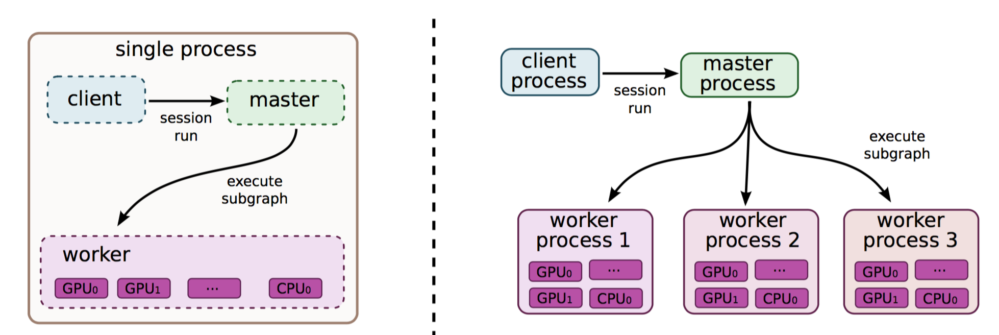

让TensorFlow们飞一会儿
<!--more-->

前一篇文章说过了TensorFlow单机多卡情况下的分布式部署，毕竟，一台机器势单力薄，想叫兄弟们一起来算神经网络怎么办？我们这次来介绍一下多机多卡的分布式部署。

其实多机多卡分布式部署在我看来相较于单机多卡分布式更容易一些，因为一台机器下需要考虑我需要把给每个device分配哪些操作，这个过程很繁琐。多台机器虽然看起来更繁琐，然而我们可以把每一台机器看作是一个单卡的机器，并且谷歌爸爸已经把相对复杂的函数都给封装好了，我们直接拿来用就行。为什么这么说呢？我们首先介绍两个概念**In-graph模式**和**Between-graph模式**：

**In-graph模式**: 这个模式跟单机单卡是差不多的，我们需要把不同的节点分配给不同的设备，比如说我让某台机器的某个GPU做一部分卷积，另外某台机器的某个GPU做另外一部分卷积，这样大家都有活干。想象总是美好的，在实际情况中会出现什么问题呢？数据搬移量太大，会有相当一部分时间耗费再数据搬移之下，Tensor翻山越岭，穿过网线，来到一个设备中，凳子还没坐热，有出发去另外一个设备。在大量训练数据的情况下，这种方法往往是不可取的。

**Between-graph模式**： 这个模式下每一个设备都相当于独立的完成整个卷积神经网络的操作，只是在开始时从参数服务器中取到参数，然后结束的时候送回参数。所以除了chief节点以外，所有人都可以在训练过程中随时退出，随时加入，但是刚开始时，大家都要响应一下chief节点的号召。这样显然更合理一点，在大量数据的情况下我们会选用这个方法，下面的代码也会以Between-graph模式作为例子。

上文提到在Between-graph模式下我们需要在训练过程中从参数服务器中获取参数，那么问题来了，什么是参数服务器？接下来我们再引入两个概念（忍一下忍一下，很简单）：

**参数服务器**：顾名思义，参数服务器嘛，保存参数用的服务器，简称ps(paramEter severs)。参数服务器可以不止一个，如果参数量过大的话，我们可以多叫几台计算机过来充当参数服务器，用来更新参数。

**工作服务器**： 顾名思义，工作服务器嘛，干活的，简称worker。一般为GPU们，能够进行快速并行计算的设备，它可以从参数服务器中把参数荡下来，然后计算出来以后在传上去。

基础的介绍完了，同样的每个工作模式下都会有参数同步更新和异步更新，下面放张就是那么个意思的图(现在没图都不好写博客了…)。

好，总结一下，我们可以设置多个参数服务器(ps)用来存储更新参数，同时我们也可以设置多个工作服务器(worker)用来进行计算。这样就组成了一个多机多卡分布式的Tensorflow开发环境。

